# Mapa de la Aplicación - ChambaApp Backend

Este documento mapea cómo se organizan y se referencian los módulos del backend de ChambaApp. Sirve como guía rápida para entender dependencias, responsabilidades, flujos de datos y puntos de integración entre módulos.

## Vista General

ChambaApp Backend es un monolito modular NestJS. Todos los módulos se cargan desde `AppModule`, comparten el mismo proceso Node.js y acceden a infraestructura común:

- PostgreSQL mediante Prisma para datos transaccionales.
- MongoDB mediante Mongoose para chat, notificaciones y logs.
- JWT/Passport para autenticación HTTP.
- Socket.IO para eventos en tiempo real.

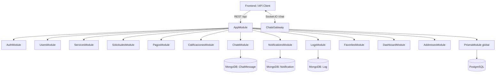

## Módulos Registrados en `AppModule`

| Módulo                 | Carpeta              | Responsabilidad principal                                      |
| ---------------------- | -------------------- | -------------------------------------------------------------- |
| `AuthModule`           | `src/auth`           | Registro, login, JWT y estrategia de autenticación             |
| `UsersModule`          | `src/users`          | Usuarios, perfil personal, perfil profesional y disponibilidad |
| `PrismaModule`         | `src/prisma`         | Cliente Prisma global para PostgreSQL                          |
| `ServicesModule`       | `src/services`       | Servicios publicados y categorías                              |
| `SolicitudesModule`    | `src/solicitudes`    | Solicitudes, agenda, reprogramación y trabajos del prestador   |
| `PagosModule`          | `src/pagos`          | Pagos legacy y pago simulado por solicitud                     |
| `CalificacionesModule` | `src/calificaciones` | Reseñas, calificaciones y reputación                           |
| `NotificationsModule`  | `src/notifications`  | Notificaciones persistentes en MongoDB                         |
| `ChatsModule`          | `src/chats`          | Conversaciones REST, mensajes MongoDB y Socket.IO              |
| `LogsModule`           | `src/logs`           | Logs administrativos en MongoDB                                |
| `FavoritesModule`      | `src/favorites`      | Prestadores favoritos del cliente                              |
| `DashboardModule`      | `src/dashboard`      | Métricas de cliente, prestador y ganancias                     |
| `AddressesModule`      | `src/addresses`      | Direcciones guardadas del usuario                              |

## Grafo de Dependencias de Módulos

`PrismaModule` está marcado como `@Global()`, por eso varios módulos usan `PrismaService` sin importar explícitamente `PrismaModule`.

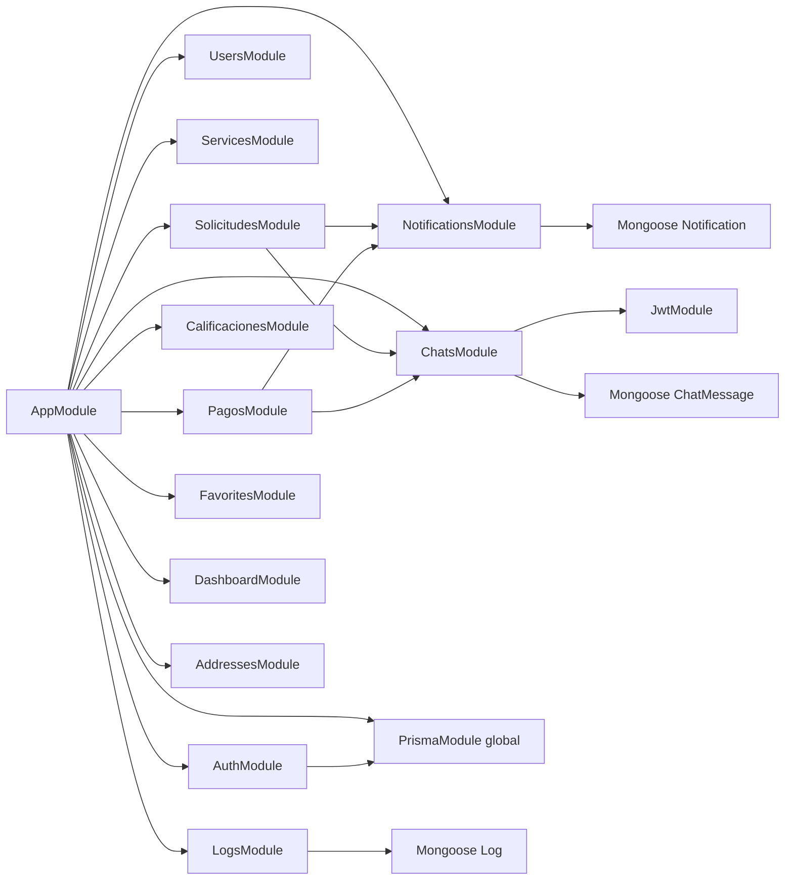

## Dependencias por Servicio

| Servicio                | Depende de                                              | Uso principal de la dependencia                                     |
| ----------------------- | ------------------------------------------------------- | ------------------------------------------------------------------- |
| `AuthService`           | `PrismaService`, `JwtService`                           | Buscar usuarios/roles, crear usuarios, firmar JWT                   |
| `UsersService`          | `PrismaService`                                         | CRUD de usuarios y perfiles                                         |
| `ServicesService`       | `PrismaService`                                         | Catálogo, categorías, rating, distancia                             |
| `SolicitudesService`    | `PrismaService`, `NotificationsService`, `ChatsGateway` | Crear/actualizar solicitudes, agenda, notificar y emitir eventos    |
| `PagosService`          | `PrismaService`, `NotificationsService`, `ChatsGateway` | Crear/confirmar pagos, notificar prestador y emitir pago confirmado |
| `CalificacionesService` | `PrismaService`                                         | Crear reseñas y calcular reputación                                 |
| `DashboardService`      | `PrismaService`                                         | Agregados de solicitudes, favoritos y pagos pagados                 |
| `FavoritesService`      | `PrismaService`                                         | Guardar/quitar prestadores favoritos                                |
| `AddressesService`      | `PrismaService`                                         | Direcciones propias del usuario                                     |
| `ChatsService`          | `ChatMessageModel`, `PrismaService`                     | Mensajes MongoDB y autorización por solicitud relacional            |
| `NotificationsService`  | `NotificationModel`                                     | CRUD de notificaciones MongoDB                                      |
| `LogsService`           | `LogModel`                                              | CRUD de logs MongoDB                                                |
| `PrismaService`         | `PrismaClient`                                          | Conexión PostgreSQL                                                 |

## Mapa de Controladores y Rutas

| Módulo         | Controlador                       | Prefijo REST          | Rutas principales                                               |
| -------------- | --------------------------------- | --------------------- | --------------------------------------------------------------- |
| Auth           | `AuthController`                  | `/api/auth`           | `POST /register`, `POST /login`                                 |
| Users          | `UsersController`                 | `/api/users`          | `GET/PATCH /profile`, CRUD admin                                |
| Users          | `ProvidersProfileController`      | `/api/providers`      | `PATCH /profile`                                                |
| Users          | `ProviderAvailabilityController`  | `/api/provider`       | `PATCH /availability`                                           |
| Services       | `ServicesController`              | `/api/services`       | CRUD servicios, búsqueda pública                                |
| Services       | `CategoriesController`            | `/api/categories`     | `GET /`                                                         |
| Solicitudes    | `SolicitudesController`           | `/api/solicitudes`    | CRUD legacy                                                     |
| Solicitudes    | `RequestsController`              | `/api/requests`       | crear, listar propias, cancelar, reprogramar, aceptar propuesta |
| Solicitudes    | `ProviderRequestsController`      | `/api/provider`       | bandeja, aceptar, rechazar, agenda y jobs                       |
| Pagos          | `PagosController`                 | `/api/pagos`          | CRUD legacy de pagos                                            |
| Pagos          | `RequestPaymentsController`       | `/api/requests`       | `GET/POST /:id/payment`, `PATCH /:id/payment/confirm`           |
| Calificaciones | `CalificacionesController`        | `/api/calificaciones` | CRUD reseñas legacy                                             |
| Calificaciones | `RequestReviewsController`        | `/api/requests`       | `POST /:id/review`                                              |
| Calificaciones | `ProviderPublicReviewsController` | `/api/providers`      | `GET /:id/reviews`                                              |
| Calificaciones | `ProviderReviewSummaryController` | `/api/provider`       | `GET /reviews/summary`                                          |
| Dashboard      | `DashboardController`             | `/api/dashboard`      | `GET /client`, `GET /provider`                                  |
| Dashboard      | `ProviderEarningsController`      | `/api/provider`       | `GET /earnings/summary`, `GET /transactions`                    |
| Chats          | `ChatsController`                 | `/api/chats`          | CRUD mensajes legacy                                            |
| Chats          | `ConversationsController`         | `/api/conversations`  | conversaciones por solicitud                                    |
| Notifications  | `NotificationsController`         | `/api/notifications`  | CRUD notificaciones                                             |
| Logs           | `LogsController`                  | `/api/logs`           | CRUD logs admin                                                 |
| Favorites      | `FavoritesController`             | `/api/favorites`      | listar/agregar/quitar favoritos                                 |
| Addresses      | `AddressesController`             | `/api/addresses`      | listar/crear/actualizar direcciones                             |

## Persistencia por Módulo

```mermaid
flowchart TB
    subgraph SQL["PostgreSQL - Prisma"]
        Role["Role"]
        Usuario["Usuario"]
        Categoria["Categoria"]
        Servicio["Servicio"]
        Solicitud["Solicitud"]
        Direccion["Direccion"]
        Favorito["Favorito"]
        Pago["Pago"]
        Calificacion["Calificacion"]
    end

    subgraph Mongo["MongoDB - Mongoose"]
        ChatMessage["ChatMessage"]
        Notification["Notification"]
        Log["Log"]
    end

    AuthService --> Role
    AuthService --> Usuario
    UsersService --> Usuario
    ServicesService --> Servicio
    ServicesService --> Categoria
    ServicesService --> Calificacion
    SolicitudesService --> Solicitud
    SolicitudesService --> Servicio
    SolicitudesService --> Direccion
    SolicitudesService --> Pago
    SolicitudesService --> Notification
    PagosService --> Pago
    PagosService --> Solicitud
    PagosService --> Notification
    CalificacionesService --> Calificacion
    CalificacionesService --> Solicitud
    DashboardService --> Solicitud
    DashboardService --> Favorito
    DashboardService --> Pago
    ChatsService --> ChatMessage
    ChatsService --> Solicitud
    NotificationsService --> Notification
    LogsService --> Log
    FavoritesService --> Favorito
    FavoritesService --> Usuario
    AddressesService --> Direccion
```

## Referencias Entre Dominios

### Usuarios, roles y autenticación

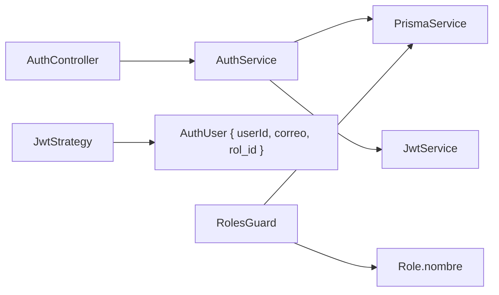

Relación clave:

- `AuthService` crea y autentica usuarios.
- `JwtStrategy` convierte el payload JWT `{ sub, correo, rol_id }` en `AuthUser`.
- `RolesGuard` consulta la base para validar el nombre del rol contra `@Roles(...)`.
- Los demás controladores reciben el usuario con `@CurrentUser()`.

### Catálogo y prestadores

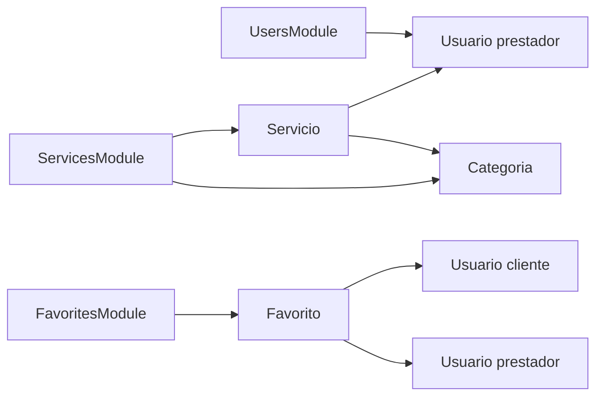

Relación clave:

- Un prestador es un `Usuario` con rol `prestador`.
- Un `Servicio` pertenece a un prestador.
- Un `Servicio` puede pertenecer a una `Categoria`.
- Un cliente marca favoritos por `prestador_id`, no por `servicio_id`.

### Solicitudes, agenda y trabajos

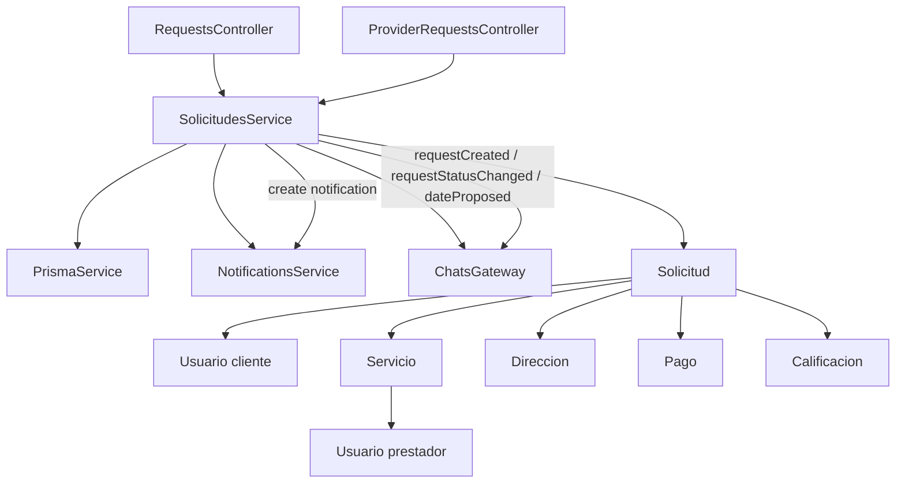

Reglas principales:

- `POST /api/requests` requiere fecha futura y duración positiva.
- La aceptación usa transacción y bloqueo por prestador para evitar dobles reservas.
- El conflicto de agenda responde con `SCHEDULE_CONFLICT`.
- Cliente puede reprogramar mientras está `pending`.
- Prestador puede proponer fecha mientras está `pending`.
- Cliente puede aceptar propuesta pendiente.

### Pagos y ganancias

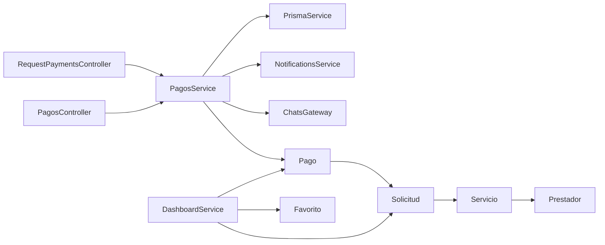

Reglas principales:

- Un pago pertenece a una solicitud y `solicitud_id` es único.
- El cliente no puede manipular el monto; se calcula en backend.
- Sólo pagos `paid` impactan dashboard, ganancias y transacciones.
- Al confirmar pago, `PagosService` notifica al prestador y emite `paymentPaid`.

### Chat y eventos en tiempo real

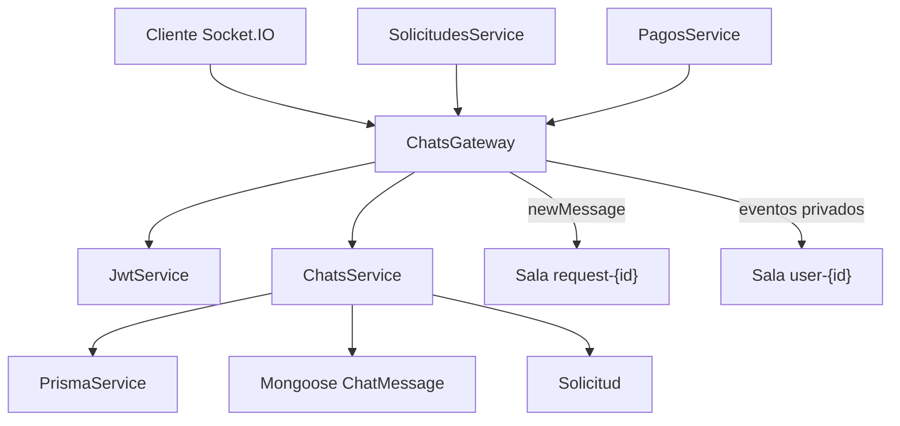

Salas y convenios:

| Sala                    | Uso                                                                             |
| ----------------------- | ------------------------------------------------------------------------------- |
| `user-{id}`             | Sala privada del usuario autenticado; se une automáticamente al conectar socket |
| `request-{solicitudId}` | Sala de conversación de una solicitud; se autoriza contra PostgreSQL            |

Eventos emitidos por dominio:

| Emisor interno       | Evento                 | Destinatario                     |
| -------------------- | ---------------------- | -------------------------------- |
| `SolicitudesService` | `requestCreated`       | Prestador                        |
| `SolicitudesService` | `requestStatusChanged` | Cliente o prestador según acción |
| `SolicitudesService` | `requestRescheduled`   | Prestador                        |
| `SolicitudesService` | `dateProposed`         | Cliente                          |
| `SolicitudesService` | `dateAccepted`         | Prestador                        |
| `PagosService`       | `paymentPaid`          | Prestador                        |
| `ChatsGateway`       | `newMessage`           | Sala `request-{id}`              |

### Calificaciones y reputación

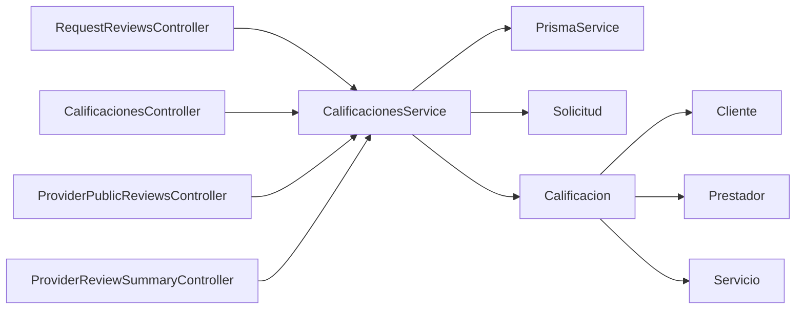

Reglas principales:

- Sólo se califica una solicitud completada.
- Una solicitud sólo puede tener una calificación.
- La reputación del prestador se calcula desde `Calificacion.puntuacion`.

## Flujo Completo Cliente - Prestador

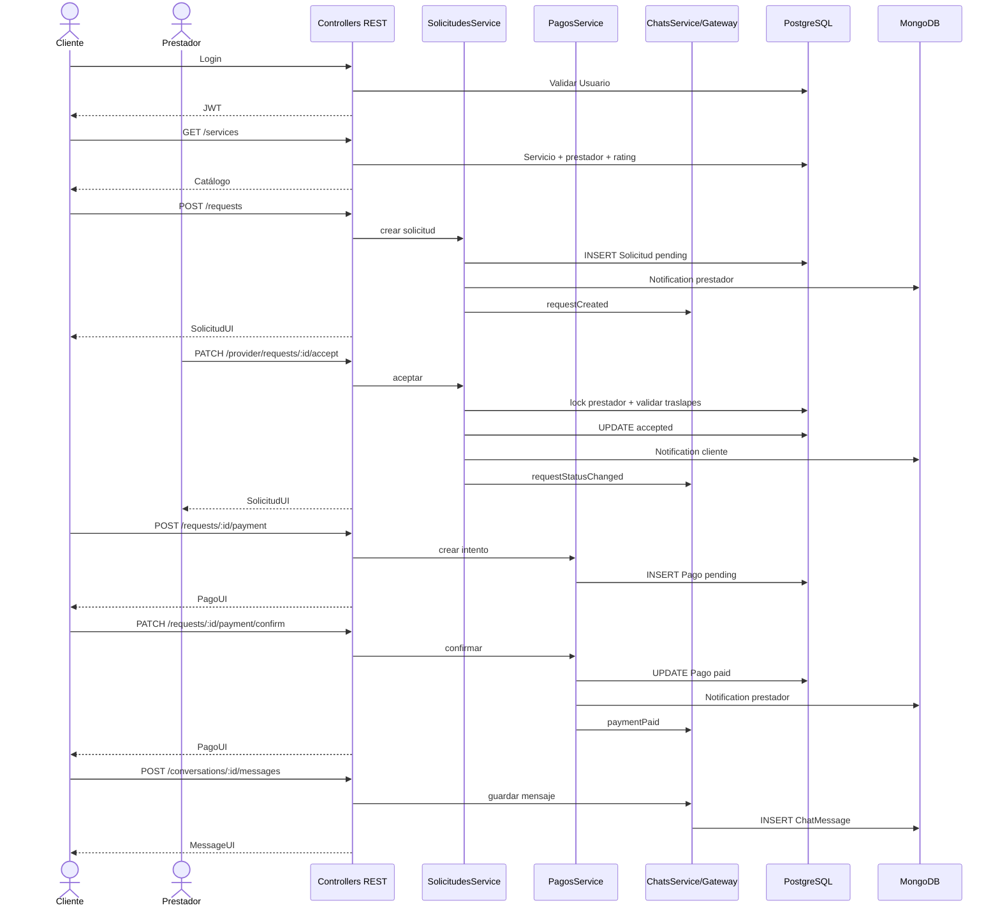

## Tabla de Impacto por Cambio

| Si modificas...       | Revisa también...                                                                           | Por qué                                              |
| --------------------- | ------------------------------------------------------------------------------------------- | ---------------------------------------------------- |
| `Usuario` en Prisma   | `AuthService`, `UsersService`, `ServicesService`, `RolesGuard`, seed                        | Es base para auth, perfil, prestador y permisos      |
| `Role` o IDs de roles | `RolesGuard`, servicios que comparan `rolId === 1`, seed                                    | Admin se asume como `rol_id = 1` en varias reglas    |
| `Servicio`            | `ServicesService`, `SolicitudesService`, `CalificacionesService`, dashboard                 | Solicitudes, pagos y reseñas dependen del servicio   |
| `Solicitud.estado`    | `SolicitudesService`, `PagosService`, `DashboardService`, `CalificacionesService`, frontend | Estados habilitan pagos, avances, reseñas y métricas |
| Agenda de solicitudes | `ensureAvailable`, calendario, pruebas `solicitudes.schedule.spec.ts`                       | Evita dobles reservas del prestador                  |
| `Pago.estado`         | `PagosService`, `DashboardService`, `DOCUMENTACION_CONSUMO_API.md`                          | Sólo `paid` suma a ganancias                         |
| Eventos Socket.IO     | `ChatsGateway`, frontend, pruebas de gateway                                                | Cambia integración en tiempo real                    |
| DTOs de entrada       | Controllers, `ValidationPipe`, documentación de consumo                                     | Campos no declarados se rechazan globalmente         |
| Mongo schemas         | Services de chat/notificaciones/logs                                                        | Cambia persistencia documental                       |

## Rutas Críticas por Pantalla

| Pantalla / flujo     | Módulos involucrados                     | Rutas principales                                                                         |
| -------------------- | ---------------------------------------- | ----------------------------------------------------------------------------------------- |
| Login/registro       | Auth                                     | `/api/auth/register`, `/api/auth/login`                                                   |
| Perfil cliente       | Users, Addresses, Favorites              | `/api/users/profile`, `/api/addresses`, `/api/favorites`                                  |
| Perfil prestador     | Users, Services, Calificaciones          | `/api/providers/profile`, `/api/provider/availability`, `/api/provider/reviews/summary`   |
| Catálogo             | Services, Calificaciones, Favorites      | `/api/services`, `/api/categories`, `/api/providers/:id/reviews`                          |
| Crear solicitud      | Solicitudes, Notifications, Chats        | `/api/requests`                                                                           |
| Bandeja prestador    | Solicitudes, Notifications, Chats        | `/api/provider/requests`, `/api/provider/calendar`                                        |
| Trabajo en ejecución | Solicitudes                              | `/api/provider/jobs`, `/api/provider/jobs/:id/status`                                     |
| Pago                 | Pagos, Dashboard, Notifications, Chats   | `/api/requests/:id/payment`, `/api/requests/:id/payment/confirm`                          |
| Chat                 | Chats, Solicitudes                       | `/api/conversations`, `/api/conversations/:id/messages`, Socket `/chat`                   |
| Dashboard cliente    | Dashboard, Solicitudes, Pagos, Favorites | `/api/dashboard/client`                                                                   |
| Dashboard prestador  | Dashboard, Pagos, Calificaciones         | `/api/dashboard/provider`, `/api/provider/earnings/summary`, `/api/provider/transactions` |

## Capas y Responsabilidades

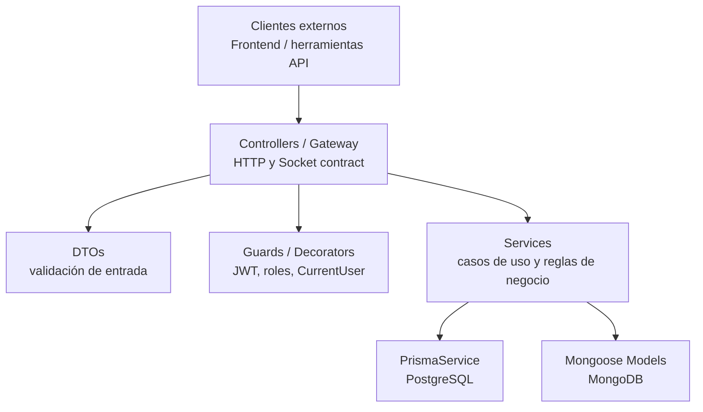

Regla de mantenimiento:

- Los controllers deben mantenerse delgados.
- Las reglas de negocio y propiedad pertenecen a services.
- Los DTOs validan forma y tipos, no deben contener lógica de dominio compleja.
- Prisma/Mongoose deben ser detalles de infraestructura consumidos desde services.

## Archivos Clave

| Archivo                                      | Rol en el mapa                                |
| -------------------------------------------- | --------------------------------------------- |
| `src/app.module.ts`                          | Registra todos los módulos y conecta MongoDB  |
| `src/main.ts`                                | Define `/api`, CORS y `ValidationPipe` global |
| `src/prisma/prisma.module.ts`                | Hace global a `PrismaService`                 |
| `prisma/schema.prisma`                       | Mapa relacional PostgreSQL                    |
| `src/auth/guards/roles.guard.ts`             | Validación central de roles                   |
| `src/auth/jwt/jwt.strategy.ts`               | Traducción JWT a `AuthUser`                   |
| `src/solicitudes/solicitudes.service.ts`     | Reglas de agenda, estados y privacidad        |
| `src/pagos/pagos.service.ts`                 | Reglas de pago, monto y confirmación          |
| `src/chats/chats.gateway.ts`                 | Socket.IO autenticado y eventos               |
| `src/chats/chats.service.ts`                 | Conversaciones ligadas a solicitudes          |
| `src/dashboard/dashboard.service.ts`         | Agregados de cliente/prestador                |
| `src/notifications/notifications.service.ts` | Notificaciones persistentes                   |

## Resumen Mental Rápido

```text
Auth autentica usuarios y produce AuthUser.
Users administra perfiles.
Services publica el catálogo.
Solicitudes une cliente + servicio + prestador y controla agenda.
Pagos depende de Solicitud aceptada y alimenta Dashboard.
Calificaciones depende de Solicitud completada.
Chats usa Solicitud para autorizar conversación.
Notifications recibe eventos desde Solicitudes y Pagos.
Dashboard lee Solicitudes, Pagos, Favoritos y Calificaciones.
Prisma sostiene el dominio relacional.
Mongo sostiene comunicación y operación documental.
```
